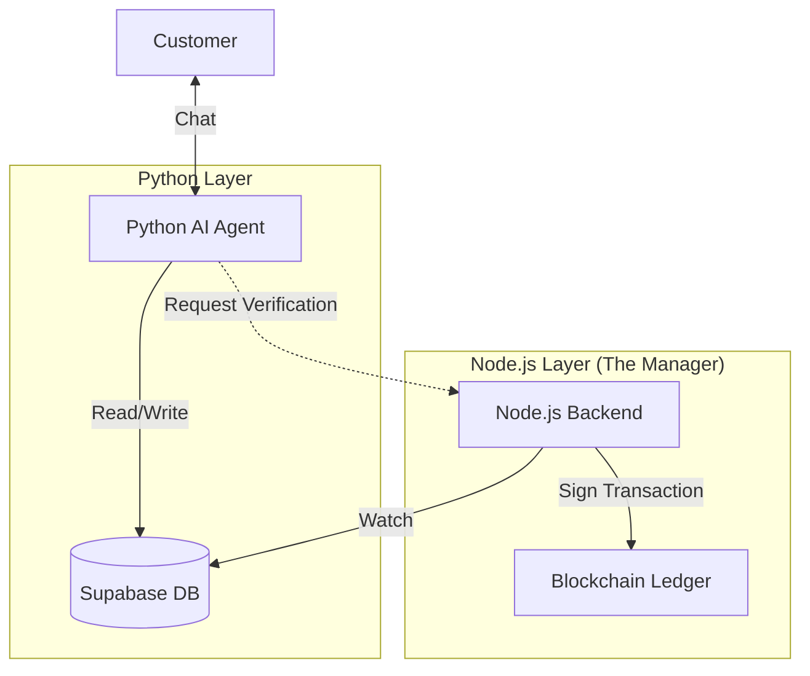

# AI Sales Agent & Blockchain Interaction Strategy

This document defines how your **Python AI Agent** (Gemini + FastAPI) interacts with your **Node.js Inventory System** (Blockchain).

## 1. The Relationship: "Front Office" vs "Back Office"

- **The AI Agent (Front Office):** Talks to customers, checks prices, and "sells" the product. It runs on **FastAPI (Python)**.
- **The Inventory System (Back Office):** Holds the actual stock, manages the database, and records the **Blockchain Ledger**. It runs on **Express (Node.js)**.

## 2. Interaction Occasions (When do they talk?)

The AI Agent interacts with the Blockchain Indirectly (via the Node.js API) in these specific scenarios:

### Scenario A: Verifying "True" Stock (The Trust Layer)

**Occasion:** A customer asks, _"Is this authentic?"_ or _"Do you actually have this much stock?"_

- **Flow:**
  1.  **AI Intent:** `availability_check` or `authenticity_check`.
  2.  **AI Action:** Calls Node.js API `GET /blockchain/history/:sku`.
  3.  **Result:** AI receives the immutable blockchain history (e.g., "Stock added on Dec 1st, Verified by Owner").
  4.  **AI Response:** "Yes, I can verify on the blockchain that we received 50 authentic units last week."

### Scenario B: Closing a Sale (The Audit Layer)

**Occasion:** The AI Agent completes a sale in the chat.

- **Flow:**
  1.  **AI Intent:** `place_order` (Future intent).
  2.  **AI Action:** Calls Node.js API `POST /api/sales` (or updates Supabase directly).
  3.  **System Action:** The Node.js Backend detects the sale -> **Automatically Logs to Blockchain**.
  4.  **Result:** The sale is permanently recorded on-chain.
  5.  **Benefit:** You have an unchangeable audit trail of every sale made by the AI.

## 3. Architecture Diagram

## 4. Specific Integration Points

If you are integrating the code you provided:

1.  **Inventory Query (Read):**
    - **AI:** Queries `retailer_inventory` table in Supabase.
    - **Blockchain:** Not involved (Speed is priority).
2.  **Sale Completion (Write):**
    - **AI:** Writes a new row to `transactions` table.
    - **Blockchain:** The Node.js _Blockchain Service_ should listen for new rows in `transactions` (using Supabase Realtime or Webhooks) and trigger `recordAction('Sale', ...)`.

## 5. Summary

The AI Agent typically **READS** from the Database for speed but relies on the Backend to **WRITE** to the Blockchain for security. The AI does not need its own Wallet; it instructs the System to sign transactions on its behalf.
