# AI-Powered Retail Inventory & Sales Agent Platform

**Core System Documentation**

---

## 1. Executive Summary

### The Problem

Small shop owners are stuck in the past. They struggle to remember thousands of prices, lose customers when they can't find stock instantly, and waste hours manually updating dusty ledgers. Current software is too complex (too many buttons) or too expensive.

### The Solution

We have built an **AI Sales Agent** that acts like a "Super-Employee". It lives on the shop owner's phone, speaks their language (English, Hindi, Hinglish), and knows the exact location and price of every item in the store.

### Key Benefit: "No Buttons, Just Talk"

Instead of tapping 10 menus to find a product, the retailer simply asks: _"Dettol soap hai kya?"_
The AI instantly checks the backend, confirms stock, guides the sale, and updates the inventory—replacing manual work with a simple conversation.

---

## 2. System Architecture (High-Level)

This system connects a simple mobile interface to a powerful cloud brain.

### The Flow

**[Device]** → **[Cloud API]** → **[Smart Database]** → **[AI Agent]**

1.  **Frontend (The Face):** A clean, mobile-first website that works on any phone.
2.  **Backend (The Muscle):** APIs that handle security, logic, and speed.
3.  **Database Layer (The Memory):** A unique "Two-Database" system for privacy and sharing.
4.  **AI Agent (The Brain):** Decides what the user wants and generates human-like responses.

### Block Diagram

```mermaid
graph LR
    Phone[📱 Retailer's Phone] -->|Chat/Voice| Cloud[☁️ Cloud Server]
    Cloud -->|Query| AI[🤖 AI Agent]
    AI -->|Search| DB[(🗄️ Database Layer)]
    DB -->|Results| AI
    AI -->|Response| Phone
```

---

## 3. Core Components (Step-by-Step)

### a) Retailer Interface (UI)

Designed for busy shop counters.

- **Dashboard:** See total sales and low-stock warnings at a glance.
- **My Inventory:** A searchable list of all products in the shop.
- **Billing / POS:** Fast checkout screen.
- **Mobile-First Design:** On a phone, the sidebar hides automatically. You can switch between "Chat" and "Inventory" with a single tap.

### b) Backend Services

- **Authentication:** Ensures only the shop owner can log in.
- **Inventory Management:** Adds, removes, and updates stock counts.
- **Billing Engine:** Calculates totals, taxes, and discounts automatically.
- **API Support:** Ready to connect with barcode scanners or other apps.

---

## 4. The Two-Database Model (Unique Feature)

We use a special design to keep data **Safe** yet **Smart**.

### 🌍 1. Common Database (Shared)

- **What it is:** A "Master Catalog" of all products that exist (e.g., Maggi, Coke, Pens).
- **Who sees it:** All retailers.
- **Purpose:** If a shop owner wants to sell "Coke", they don't have to type "Coca Cola 500ml, Black Color...". They just pull it from the Common DB.
- **Security:** Read-Only. Retailers cannot change the master definitions.

### 🔒 2. Private Database (Retailer-Owned)

- **What it is:** The shop's personal digital locker.
- **Who sees it:** **ONLY** that specific shop owner.
- **Content:**
  - "I have 5 bottles." (Inventory)
  - "I sell it for ₹18." (My Price)
  - "I give 5% discount." (My Rules)
  - "I sold 10 today." (My Sales)
- **Security:** Strictly separated. Shop A cannot see Shop B's private sales data.

**Why?** It gives the convenience of a shared catalog (fast setup) with the absolute privacy of a personal ledger.

---

## 5. Data Flow (Customer → AI → Retailer)

**Scenario:** A customer walks in and asks for registers.

**Step 1:** Customer asks: _"Give me 5 registers."_
**Step 2:** Retailer asks AI: _"5 register hai?"_
**Step 3:** **AI Agent Work:**
_ Understands "register" (Intent).
_ Checks **Private Inventory** for stock.
_ Confirms: "Yes, we have Classmate Registers."
**Step 4:** AI Responds: _"Haan, Classmate Registers hain. Stock: 20. Price: ₹50."_
**Step 5:** **Human Action:** Retailer hands over 5 registers to customer.
**Step 6:** Retailer tells AI: _"Sold 5."\*
**Step 7:** AI updates stock (20 → 15) and records the transaction.

_(If unavailable: AI checks stock, sees 0, and says "Sorry, Out of Stock." It then marks it in the "To-Buy" list.)_

---

## 6. Security & Anti-Theft Logic

- **Authentication:** Secure Login (Email/Password). No unauthorized access.
- **Role-Based Access:** A "Staff" member can only _sell_, they cannot _delete_ inventory or change the Master Catalog.
- **Audit Logs:** Every single change (Stock +5, Price Changed) is recorded with a timestamp and User ID. "Who changed this?" is always answerable.
- **Blockchain Ready:** We record critical audits to a Blockchain, making them 100% tamper-proof (impossible to fake history).

---

## 7. API & Integration Capabilities

- **Webhooks:** Can notify other apps when a sale happens.
- **REST APIs:** Standard way to connect external tools.
- **POS Scanners:** Plug-and-play support for barcode guns.
- **Bill Scanning (OCR):** (Future) Take a photo of a wholesaler invoice, and the AI automatically adds the items to stock.

---

## 8. Deployment Overview

- **Frontend:** Hosted on **Vercel** (Fast, global CDN).
- **Backend:** Hosted on a Cloud Server (Scalable Python/Node environment).
- **Database:** Powered by **Supabase (PostgreSQL)**.
- **Config:** All secrets (API Keys, Passwords) are hidden in Environment Variables (`.env`), never in the code.

---

## 9. Use Case Diagram (Textual)

- **Retailer** ↔ uses ↔ **AI Agent** (to manage shop)
- **AI Agent** ↔ accesses ↔ **Private DB** (to check retail stock)
- **AI Agent** ↔ accesses ↔ **Master Catalog** (to identify products)
- **Customer** ↔ pays ↔ **Retailer** (Physical interaction)
- **System** ↔ records ↔ **Payment Gateway** (Digital Transaction)

---

## 10. Summary (Plain English)

Imagine you hired a manager who has a photographic memory.
You don't need to type on a computer. You just talk to them.
_"Do we have milk?"_ → They check instantly.
_"Sell 2 packets."_ → They write it down instantly.
_"What's total sales today?"_ → They tell you instantly.

This system is that helper. It uses AI to listen to you, a Private Database to keep your secrets safe, and a Shared Catalog to make setting up your shop as easy as downloading an app. It turns a chaotic shop into an organized business.
