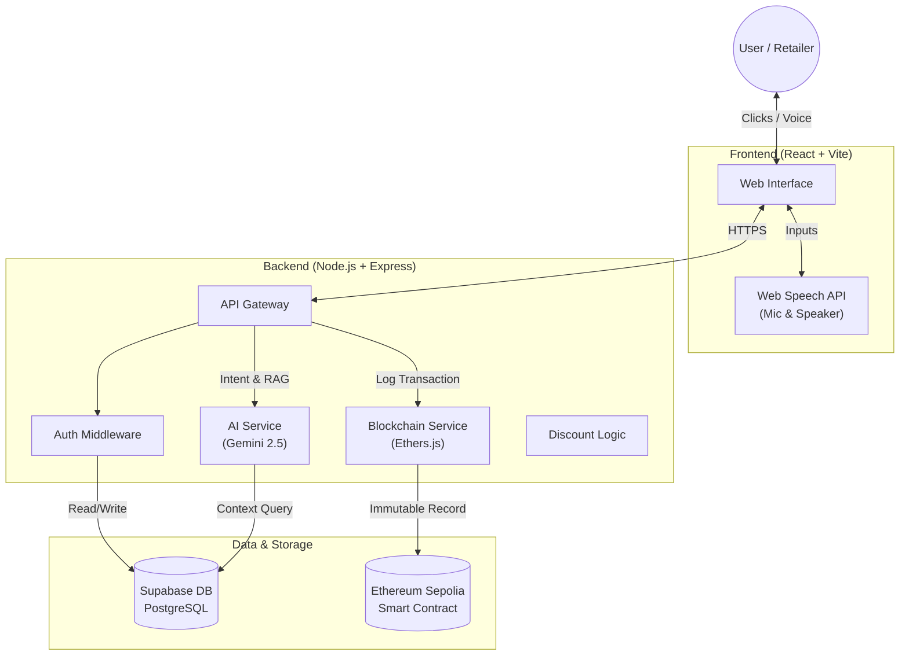
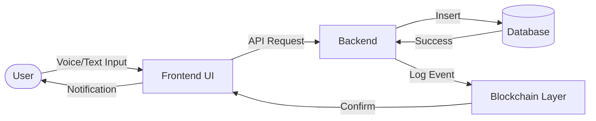
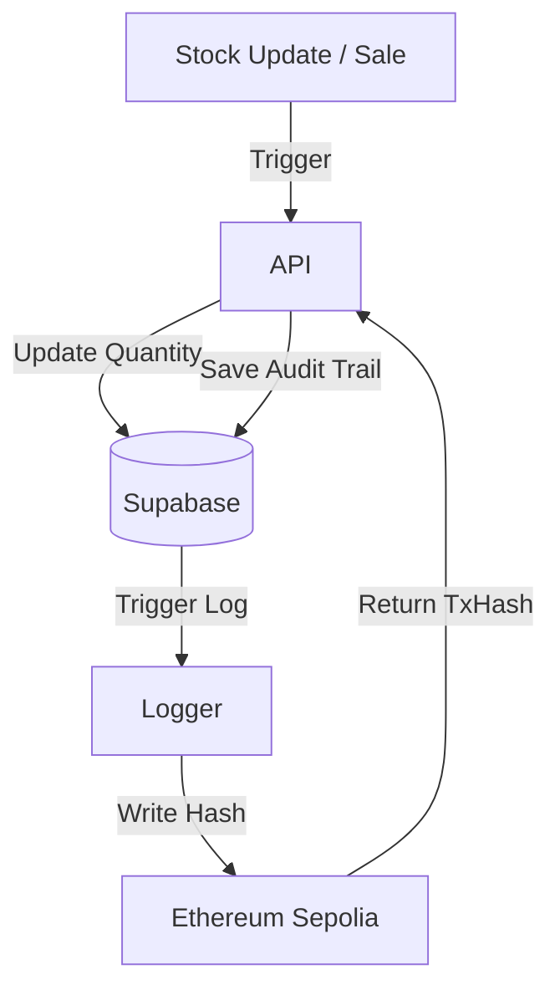
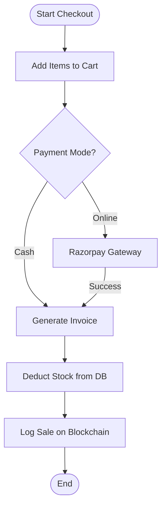
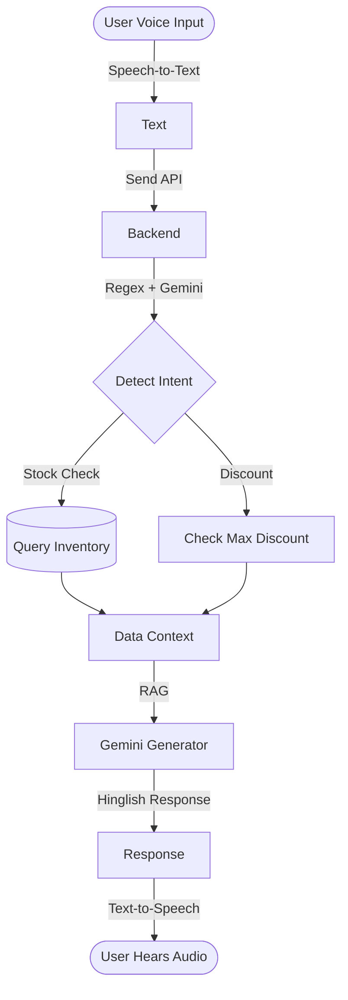
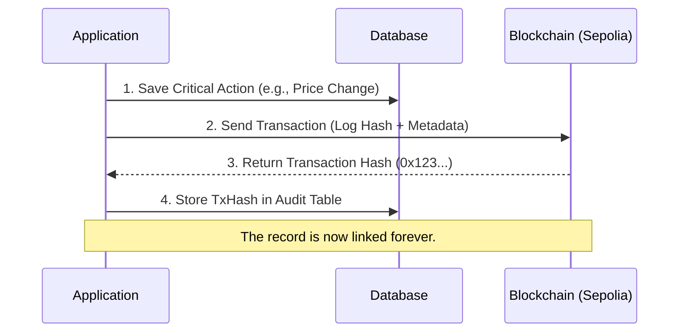
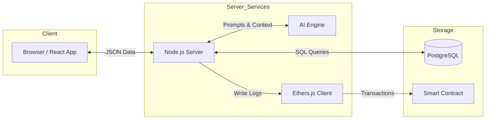

# AI-Powered Blockchain Inventory Management System

> **Technical Documentation & Pitch Deck**

## 1. Executive Summary

**The Problem:**
Traditional inventory systems are static. Retailers struggle with:

- Manual data entry errors.
- Lack of real-time visibility into stock.
- No "smart" assistance for negotiations or insights.
- Trust issues regarding audit trails and stock history.

**The Solution:**
We have built a **Next-Generation Inventory Platform** that combines three cutting-edge technologies:

1.  **Artificial Intelligence (Gemini 2.5):** Acts as a smart shopkeeper assistant (Sales/Support).
2.  **Blockchain (Ethereum/Sepolia):** Provides an immutable, tamper-proof audit trail for every stock movement.
3.  **Real-Time Cloud Database (Supabase):** Ensures instant synchronization across devices.

**Target Audience:**

- **Retailers:** For managing shops efficiently with voice & AI.
- **Wholesalers:** For tracking distribution.
- **Admins:** For overseeing system integrity via Blockchain audits.

---

## 2. System Architecture

This High-Level Architecture demonstrates how the User interacts with the modern web stack and how data flows securely to both the Database and the Blockchain.

---

## 3. Detailed Working (Step-by-Step)

1.  **User Login:**

    - Retailers log in via secure Email/Password (Supabase Auth).
    - System loads their specific, private inventory (Row Level Security).

2.  **Adding a Product:**

    - Retailer speaks: "Add 50 Dettol soaps at 45 rupees."
    - AI parses this, auto-fills the form.
    - Retailer confirms -> Saved to DB -> Hash logged on Blockchain.

3.  **Updating Stock:**

    - When sales happen, stock decreases.
    - System automatically calculates "Low Stock" alerts.
    - Every update creates a tamper-proof audit log.

4.  **Selling & Billing:**

    - User adds items to cart.
    - Payment processed via **Razorpay** (UPI/Card) or Cash.
    - Invoice generated and stock deducted instantly.

5.  **AI Interaction:**
    - User asks: "Dettol hai kya?"
    - AI checks DB.
    - AI replies (Voice + Text): "Haan ji, 50 pc available hai."

---

## 4. Operational Flowcharts

### A. Product Add Flow

### B. Inventory Update Flow

### C. Billing / POS Flow

### D. AI Interaction Flow

### E. Blockchain Logging Flow

---

## 5. Data Flow Diagram

This illustrates how data moves through the core services.

---

## 6. Core Components

- **Frontend:** React.js, TailwindCSS, Vite. (Fast, Responsive, Local First).
- **Backend:** Node.js, Express.js. (Scalable API handling).
- **Database:** Supabase (PostgreSQL). Stores Users, Products, Logs.
- **AI Module:** Google Gemini 2.5 Flash. Handles logic, intent, and persona.
- **Blockchain Module:** Ethereum (Sepolia Testnet). Stores immutable hashes of critical events.
- **Payment Gateway:** Razorpay. Handles secure payments.

---

## 7. Database Schema

Simple explanation of the data structure.

| Table Name               | Purpose                                                        |
| :----------------------- | :------------------------------------------------------------- |
| **`retailers`**          | Stores user profiles and shop details.                         |
| **`retailer_inventory`** | The main stock list. Private to each retailer (RLS protected). |
| **`master_catalog`**     | A shared database of common products (Global barcodes/images). |
| **`transactions`**       | Sales records, payment status, and invoices.                   |
| **`audit_logs`**         | Links a DB action ID to a Blockchain Transaction Hash.         |

---

## 8. AI Module Documentation

**Feature Set:**

1.  **Speech-to-Text:** Converts shopkeeper's voice to command.
2.  **Intent Recognition:** "Hybrid Brain" uses local Regex (fast) + Cloud AI (smart).
3.  **Smart Negotiation:** Hides maximum discount if the user asks for less.
4.  **Persona:** Speaks in a localized "Hinglish" shopkeeper tone.
5.  **RAG (Retrieval Augmented Generation):** Reads _actual_ database stock before answering.

**Safety:** The AI **Read-Only** access to data. It cannot delete or modify stock on its own. It never writes directly to the Blockchain.

---

## 9. Blockchain Module Documentation

**Why Blockchain?** To prevents "cooked books" or internal fraud.
**What is logged?**

- Stock Additions (Proof of Inventory).
- Price Changes (Proof of Pricing).
- Large Deletions (Proof of Waste/Theft).
  **Immutability:** Once written to the Ethereum network, the record cannot be changed by anyone, not even the admin.
  **Verification:** Any log can be verified on a public explorer (like Etherscan) using the Transaction Hash.

---

## 10. Security & Anti-Theft Logic

1.  **Authentication:** Secure JWT login via Supabase.
2.  **Row Level Security (RLS):** Retailer A cannot see Retailer B's stock.
3.  **Audit Trails:** Every sensitive action generates a "Digital Fingerprint" stored on-chain.
4.  **Role-Based Access:** Cashiers can sell, but only Managers/Admins can delete stock.

---

## 11. Deployment Overview

- **Frontend:** Hosted on **Vercel** (Global CDN, fast loading).
- **Backend:** Hosted on **Render / Vercel Serverless**.
- **Database:** Managed **Supabase** Cloud.
- **Blockchain:** Decentralized **Sepolia Network**.

---

## 12. Conclusion

This system transforms a simple inventory spreadsheet into a **smart, secure, and voice-activated assistant**.

- **AI** saves time and improves customer interaction.
- **Blockchain** builds trust and security.
- **Cloud** ensures access from anywhere.

It is **Future-Ready**, scalable to thousands of products, and designed for the modern retailer.
