# 🔄 Complete System Flow Diagrams

## System Architecture Flow

---

## Add Product Flow

```mermaid
sequenceDiagram
    actor User
    participant UI as Frontend
    participant API as Backend API
    participant DB as Supabase
    participant BC as Blockchain Service
    participant SC as Smart Contract
    
    User->>UI: Click "Add Product"
    User->>UI: Fill form (name, SKU, price, qty)
    User->>UI: Click "Save"
    
    UI->>API: POST /api/inventory
    
    Note over API: Validate input
    
    API->>DB: INSERT product
    DB-->>API: Success ✅
    API-->>UI: 201 Created
    UI-->>User: ✅ Success message
    
    Note over User: User sees product immediately
    
    par Async Blockchain Logging
        API->>BC: recordActionAsync()
        BC->>SC: Call recordAction()
        Note over SC: Validate & Store
        SC-->>BC: Transaction hash
        BC-->>API: Log confirmation
        Note over API: Console: ✅ Blockchain confirmed
    end
```

---

## Complete Sales Flow (POS)

---

## Blockchain Verification Flow

---

## Daily Operations Flow

```mermaid
flowchart TD
    Start([Morning: Login]) --> CheckInv[Check Inventory]
    CheckInv --> LowStock{Low Stock?}
    
    LowStock -->|Yes| AddStock[Add New Stock]
    LowStock -->|No| WaitSales[Wait for Customers]
    
    AddStock --> BCLog1[🔗 Blockchain: StockAdded]
    BCLog1 --> WaitSales
    
    WaitSales --> Customer[Customer Arrives]
    Customer --> SelectItems[Select Items]
    SelectItems --> Checkout[Checkout]
    
    Checkout --> PayMethod{Payment Method?}
    
    PayMethod -->|Cash| CashPay[Process Cash]
    PayMethod -->|Online| OnlinePay[Process Razorpay]
    
    CashPay --> RecordSale[Record Transaction]
    OnlinePay --> RecordSale
    
    RecordSale --> ReduceStock[Reduce Stock]
    ReduceStock --> BCLog2[🔗 Blockchain: SaleCompleted]
    
    BCLog2 --> MoreCustomers{More Customers?}
    
    MoreCustomers -->|Yes| Customer
    MoreCustomers -->|No| EOD[End of Day]
    
    EOD --> ViewBC[View Blockchain Audit]
    ViewBC --> VerifyES[Verify on Etherscan]
    VerifyES --> End([Logout])
    
    style BCLog1 fill:#f59e0b
    style BCLog2 fill:#f59e0b
    style ViewBC fill:#60a5fa
    style VerifyES fill:#22c55e
```

---

## Product Lifecycle on Blockchain

```mermaid
stateDiagram-v2
    [*] --> ProductAdded: Add Product
    
    ProductAdded --> StockAdjusted: Update Quantity
    StockAdjusted --> StockAdjusted: Restock
    StockAdjusted --> SaleCompleted: Sell Units
    SaleCompleted --> StockAdjusted: More Stock
    SaleCompleted --> ProductRemoved: Discontinue
    
    ProductRemoved --> [*]
    
    note right of ProductAdded
        🔗 Event #1
        SKU, Initial Qty, Price
        Actor, Timestamp
    end note
    
    note right of StockAdjusted
        🔗 Event #2, #3, #4...
        Old Qty, New Qty
        Change Amount
    end note
    
    note right of SaleCompleted
        🔗 Event #N
        Items Sold
        Payment Method
        Total Amount
    end note
    
    note right of ProductRemoved
        🔗 Final Event
        Reason for Removal
        Final Qty
    end note
```

---

## Multi-User Data Flow

---

*These diagrams show how your blockchain-integrated system works end-to-end!*
