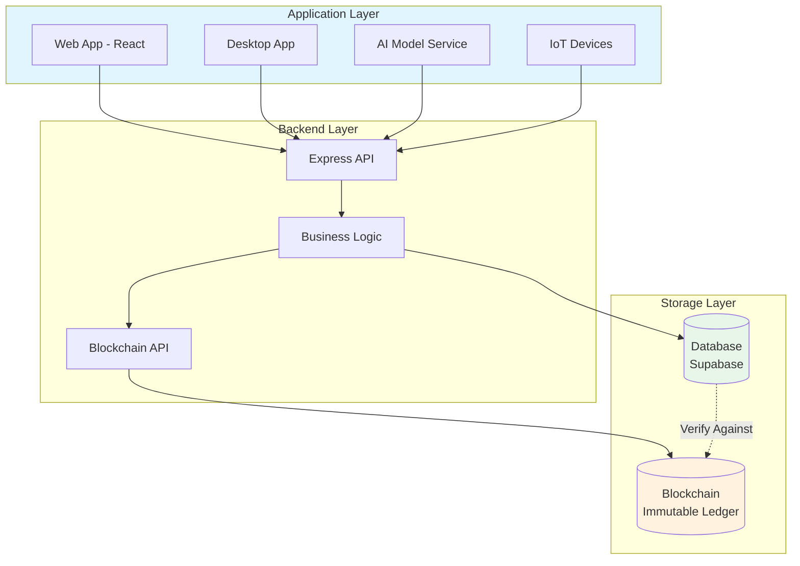
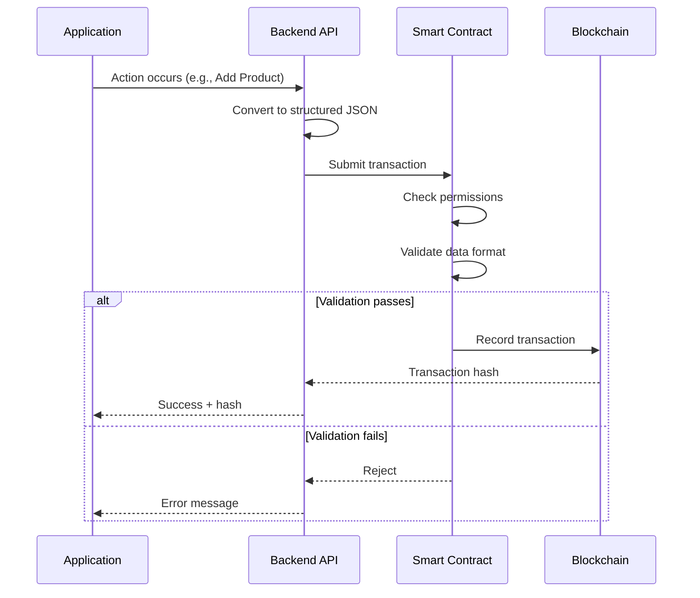
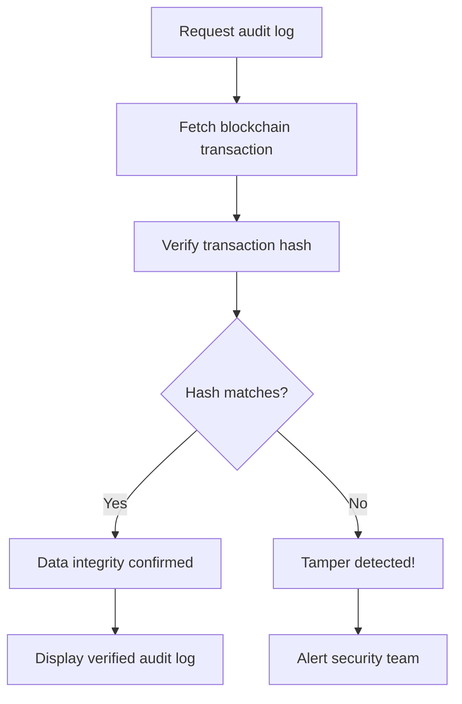
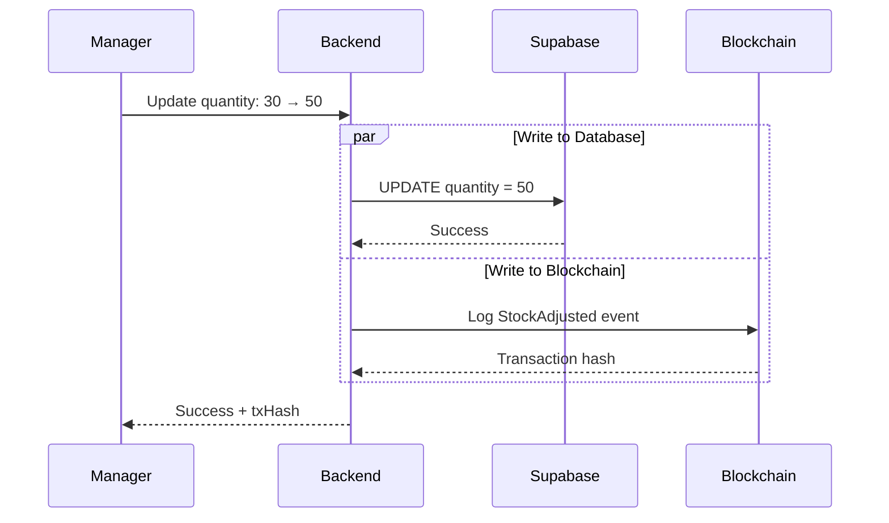

# Blockchain Module - Integration Architecture

## 🎯 Core Principle

> **Database = Fast Storage**  
> **Blockchain = Trusted History**

The Blockchain Module is an **immutable audit and trust layer** that records critical inventory actions permanently, ensuring data integrity and transparency across all applications.

---

## 🏗️ Blockchain Integration Architecture



---

## 🎭 Dual-Storage Architecture

| Aspect | Database (Supabase) | Blockchain |
|--------|---------------------|------------|
| **Speed** | Very Fast | Moderate |
| **Mutability** | Editable | Immutable |
| **Purpose** | Operational Data | Audit & Trust |
| **Storage** | Large Datasets | Critical Records |
| **Use Case** | Product catalogs, inventory counts | Who did what, when |
| **Accessibility** | High-frequency reads/writes | Verification & audit queries |

**Best Practice:** Database for operations, Blockchain for validation.

---

## 📋 Blockchain Core Responsibilities

### 1. **Immutable Inventory Logging**
Records that CANNOT be modified or deleted:
- ✅ Product added
- ✅ Product updated
- ✅ Product removed
- ✅ Stock movement
- ✅ AI-decoded voice/vision input
- ✅ IoT-triggered inventory changes

### 2. **Event-Based Data Recording**
Blockchain stores **events**, not raw tables:

```json
{
  "eventType": "ProductAdded",
  "data": {
    "sku": "SB-M10-001",
    "name": "Super Widget",
    "quantity": 50,
    "price": 100.00,
    "addedBy": "0x742d35Cc6634C0532925a3b844Bc9e7595f0bEb8",
    "source": "WebApp",
    "timestamp": 1734598034,
    "confidence": 0.94
  },
  "transactionHash": "0xabc123...",
  "blockNumber": 12345678
}
```

**Event Types:**
- `ProductAdded`
- `ProductUpdated`
- `StockAdjusted`
- `VoiceLogRecorded`
- `AIDecisionMade`
- `IoTSensorTriggered`

### 3. **Actor Authentication & Identity**
Every transaction is linked to an identity:

| Actor Type | Authentication Method |
|------------|----------------------|
| Web User (Admin/Staff) | Wallet address |
| Desktop Application | API key → Wallet mapping |
| AI Model Service | Service wallet |
| IoT Device | Device wallet |

### 4. **Time & Location Proof**
Each blockchain entry includes:
- ⏰ **Timestamp:** Block time (immutable)
- 📍 **Geo-location:** Optional GPS coordinates
- 🖥️ **Source System:** WebApp/Desktop/AI/IoT identifier

### 5. **AI-Verified Data Storage**
Stores AI-decoded results, not raw media:

```json
{
  "action": "ADD_PRODUCT",
  "sku": "SB-M10-001",
  "quantity": 50,
  "confidence": 0.94,
  "aiModel": "gemini-pro-v2",
  "rawDataHash": "0x7f8c...",
  "processedAt": "2025-12-19T15:07:14Z"
}
```

### 6. **Cross-Application Synchronization**
All systems read from the same blockchain history for consistency.

---

## ⚙️ Internal Working Process

### Transaction Lifecycle



### Validation Checks
Before storage, smart contract verifies:
- ✅ Actor has permission
- ✅ Data format is valid
- ✅ Required fields present
- ✅ Signature is authentic

### Immutability Mechanism
Each block contains:
- Current block hash (based on all data inside)
- Previous block hash (links to Block N-1)
- Timestamp
- Transactions array

**Tamper-Proof:** Changing one block requires recalculating ALL subsequent hashes (computationally infeasible).

---

## 💾 Data Storage Model

### What Blockchain STORES ✅
- Transaction hash
- Event type
- Structured inventory data (SKU, quantity, price)
- Actor identity (wallet address)
- Timestamp (immutable)
- Optional metadata (location, confidence)

### What Blockchain DOES NOT Store ❌
- Full product catalogs
- Images, audio, or videos
- Large datasets
- Real-time operational queries

**These are stored in Supabase.**

---

## 🔍 Data Fetching & Verification

### Query Examples

```javascript
// Query by SKU
const events = await blockchain.queryEvents({
  eventType: 'StockAdjusted',
  filters: { sku: 'SB-M10-001' }
});

// Query by user
const userActions = await blockchain.queryEvents({
  actor: '0x742d35Cc6634C0532925a3b844Bc9e7595f0bEb8'
});

// Query by time range
const recentEvents = await blockchain.queryEvents({
  fromTimestamp: 1734000000,
  toTimestamp: 1734598034
});
```

### Verification Flow


---

## 🔐 Security Features

| Feature | Purpose |
|---------|---------|
| **Cryptographic Hashing** | SHA-256 ensures data integrity |
| **Digital Signatures** | Proves actor identity |
| **Permissioned Access** | Smart contract validates who can write |
| **Immutable Event History** | No one can erase actions |
| **Tamper Detection** | Hash mismatch alerts |

---

## 🚀 Scalability Strategy

### Design Principles
1. ✅ Blockchain stores only important events (not every read)
2. ✅ Databases handle heavy reads/writes
3. ✅ Smart contracts remain lightweight
4. ✅ Off-chain storage for large data (IPFS/Arweave)

### Example Workflow
```
User adds product
    ↓
Supabase write (FAST) ← Instant UI update
    ↓
Blockchain write (SLOWER) ← Audit trail
    ↓
Both systems have record
```

---

## 🔄 Integration with Existing System

### Database vs Blockchain

**Supabase stores current state:**
```sql
retailer_inventory
├── quantity: 50  ← Current value
└── updated_at: timestamp
```

**Blockchain stores change history:**
```json
{
  "event": "StockAdjusted",
  "oldQuantity": 30,
  "newQuantity": 50,
  "changedBy": "0x742d...",
  "reason": "Restock",
  "immutable": true
}
```

### Combined Workflow



---

## 📊 Use Cases

### 1. Audit Trail
**Q:** "Who reduced stock of Product X last week?"

```javascript
const events = await blockchain.queryEvents({
  eventType: 'StockAdjusted',
  sku: 'PRODUCT-X',
  fromTimestamp: lastWeekStart
});
```

### 2. AI Decision Verification
**Q:** "Why did AI add 100 units?"

```javascript
const aiEvent = await blockchain.getTransaction(txHash);
// Returns confidence score, reasoning, input hash
```

### 3. Cross-App Sync
Desktop app adds product → Web app sees verified record via blockchain.

---

## 🛡️ Smart Contract Example

```solidity
pragma solidity ^0.8.0;

contract InventoryAudit {
    struct InventoryEvent {
        string eventType;
        string sku;
        uint256 quantity;
        address actor;
        uint256 timestamp;
    }
    
    mapping(uint256 => InventoryEvent) public events;
    mapping(address => bool) public authorizedActors;
    uint256 public eventCount;
    
    modifier onlyAuthorized() {
        require(authorizedActors[msg.sender], "Unauthorized");
        _;
    }
    
    function logEvent(
        string memory _eventType,
        string memory _sku,
        uint256 _quantity
    ) public onlyAuthorized returns (uint256) {
        eventCount++;
        events[eventCount] = InventoryEvent({
            eventType: _eventType,
            sku: _sku,
            quantity: _quantity,
            actor: msg.sender,
            timestamp: block.timestamp
        });
        return eventCount;
    }
}
```

---

## 🔮 Future Extensions

- Smart contract-based access rules
- Automated compliance reports
- AI confidence-based validation
- Multi-chain interoperability

---

## ✅ Summary

**Blockchain guarantees that inventory actions are permanent, verifiable, and trustworthy across all applications.**

**Key:** Database = current state | Blockchain = immutable history

Together: **Secure, transparent, auditable inventory system**

---

*Last updated: December 19, 2025*
