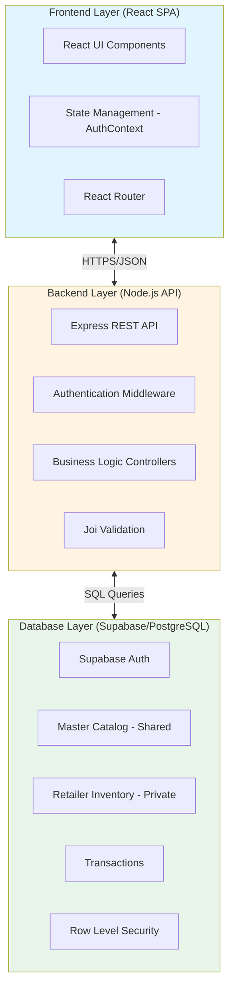
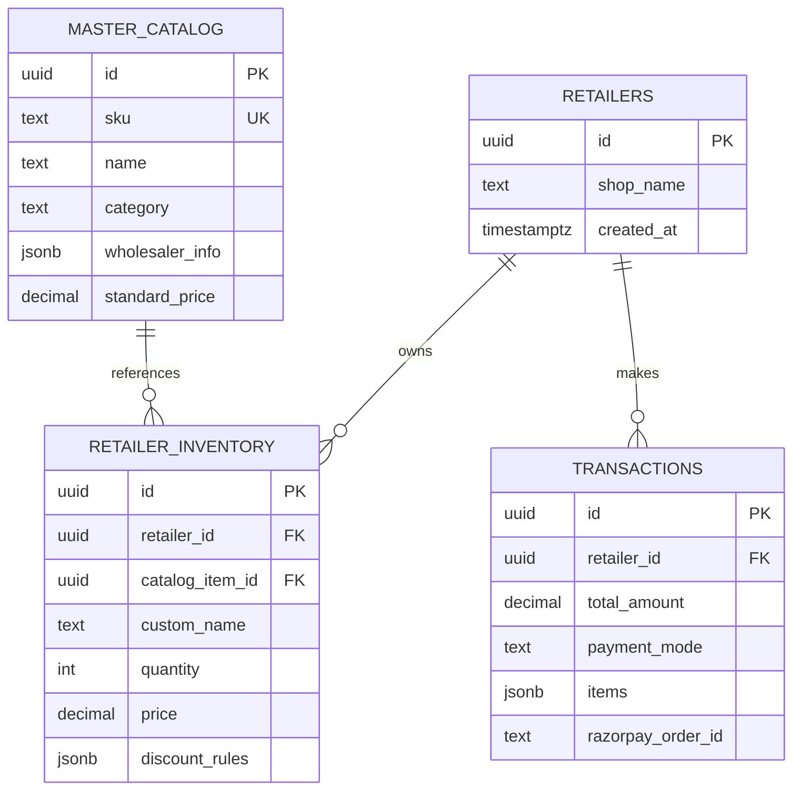
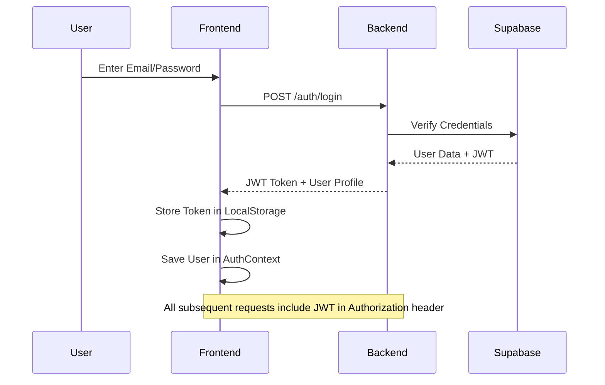
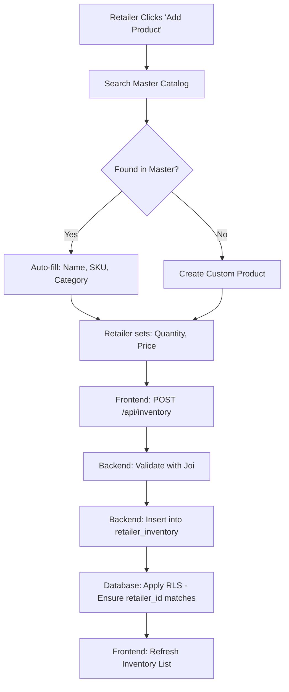
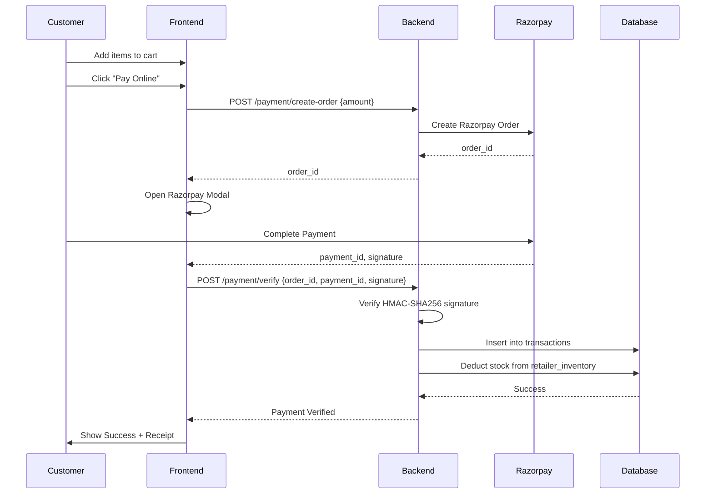
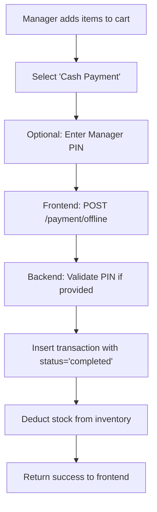

# Inventory Management System - Complete Architecture Overview

## 🎯 Executive Summary

**Project Name:** Retail Inventory & Sales Assistant Platform

**Version:** 2.0 (Multi-Tenant Architecture)

**Purpose:** A modern, cloud-based Point of Sale (POS) and Inventory Management System designed for retailers with advanced features including master catalog management, payment processing, and future AI capabilities.

---

## 📐 System Architecture

### High-Level Architecture Pattern

This system follows a **3-Tier Client-Server Architecture** with clear separation of concerns:



---

## 🛠️ Technology Stack

### Frontend Technologies
- **Framework:** React 18 with TypeScript
- **Build Tool:** Vite 5
- **Styling:** Tailwind CSS 3
- **Routing:** React Router 6
- **HTTP Client:** Axios
- **Form Handling:** React Hook Form
- **Validation:** Zod
- **Icons:** Lucide React
- **Notifications:** React Hot Toast

### Backend Technologies
- **Runtime:** Node.js v22
- **Framework:** Express.js
- **Validation:** Joi
- **Security:** Helmet, CORS
- **Logging:** Morgan
- **Payment Gateway:** Razorpay SDK

### Database & Infrastructure
- **Database:** PostgreSQL (via Supabase)
- **Authentication:** Supabase Auth (JWT-based)
- **Hosting:** Vercel/Netlify
- **Package Manager:** npm

---

## 🗂️ Project Structure

```
inventory-system/
│
├── frontend/                     # React Application
│   ├── src/
│   │   ├── api/                  # Axios client configuration
│   │   ├── components/           # Reusable UI components
│   │   ├── context/              # AuthContext (global state)
│   │   ├── layouts/              # DashboardLayout, AuthLayout
│   │   ├── pages/                # Route-level components
│   │   │   ├── Login.tsx
│   │   │   ├── Signup.tsx
│   │   │   ├── Dashboard.tsx
│   │   │   ├── Products.tsx      # Master Catalog Management
│   │   │   ├── PrivateInventory.tsx  # Retailer's private stock
│   │   │   ├── Billing.tsx       # POS/Checkout
│   │   │   └── Logs.tsx
│   │   ├── types/                # TypeScript interfaces
│   │   ├── utils/                # Helper functions
│   │   ├── App.tsx               # Router configuration
│   │   └── main.tsx              # Entry point
│   └── package.json
│
├── src/                          # Backend Application
│   ├── config/
│   │   └── supabase.js          # Database connection
│   ├── controllers/
│   │   ├── authController.js    # Login/Signup logic
│   │   ├── productController.js # Master Catalog CRUD
│   │   ├── inventoryController.js  # Private Inventory CRUD
│   │   ├── catalogController.js
│   │   └── logController.js
│   ├── middleware/
│   │   ├── authMiddleware.js    # JWT verification
│   │   └── errorMiddleware.js   # Global error handler
│   ├── routes/
│   │   ├── authRoutes.js
│   │   ├── productRoutes.js
│   │   ├── paymentRoutes.js    # Razorpay integration
│   │   ├── logRoutes.js
│   │   └── apiRoutes.js
│   ├── utils/
│   ├── app.js                   # Express app configuration
│   └── server.js                # Entry point
│
├── schema.sql                   # Initial database schema
├── schema_v2.sql               # Multi-tenant migration
├── schema_v3_transactions.sql  # Payment system schema
├── policies.sql                # RLS policies
│
├── .env.example                # Environment variables template
├── package.json                # Backend dependencies
└── vercel.json                 # Deployment configuration
```

---

## 🗄️ Database Design

### Database Philosophy: **Dual-Database Pattern**

The system uses a strategic two-database approach to balance **data sharing** with **privacy**:

#### 1. **Master Catalog** (Shared, Read-Only for Retailers)

**Purpose:** Central product definition database to ensure consistency

```sql
master_catalog
├── id (UUID, PK)
├── sku (TEXT, UNIQUE)
├── name (TEXT)
├── category (TEXT)
├── standard_price (DECIMAL)
├── wholesaler_info (JSONB)
└── created_at (TIMESTAMP)
```

**Access Control:**
- ✅ All authenticated users can READ
- ❌ Only Admins/Backend can WRITE
- **Why?** Prevents data pollution from 1000 retailers typing "iPhone 15" differently

#### 2. **Retailer Inventory** (Private, Full Control)

**Purpose:** Retailer-specific stock, pricing, and rules

```sql
retailer_inventory
├── id (UUID, PK)
├── retailer_id (UUID, FK → retailers)
├── catalog_item_id (UUID, FK → master_catalog, OPTIONAL)
├── custom_name (TEXT)
├── sku (TEXT)
├── quantity (INT)
├── price (DECIMAL)
├── low_stock_threshold (INT)
├── discount_rules (JSONB)
├── location (TEXT)
└── created_at (TIMESTAMP)
```

**Access Control:**
- ✅ Retailer A can ONLY see/edit their own inventory
- ❌ Retailer A CANNOT see Retailer B's stock or prices
- **Security:** Enforced by **Row Level Security (RLS)** at database level

#### 3. **Transactions** (Billing Records)

```sql
transactions
├── id (UUID, PK)
├── retailer_id (UUID, FK)
├── total_amount (DECIMAL)
├── payment_mode (TEXT: 'cash' | 'online')
├── status (TEXT: 'pending' | 'completed' | 'failed')
├── razorpay_order_id (TEXT, NULLABLE)
├── razorpay_payment_id (TEXT, NULLABLE)
├── razorpay_signature (TEXT, NULLABLE)
├── approved_by (UUID, FK, NULLABLE)
├── items (JSONB)  -- Snapshot of sold items
└── created_at (TIMESTAMP)
```

#### 4. **Retailers** (User Profile Extension)

```sql
retailers
├── id (UUID, PK, FK → auth.users)
├── shop_name (TEXT)
└── created_at (TIMESTAMP)
```

### Entity Relationship Diagram



---

## 🔐 Security Architecture

### 1. **Authentication Flow**



### 2. **Authorization Layers**

**Layer 1: Frontend** (UX-level protection)
- Hides Admin buttons from regular users
- Redirects unauthenticated users to `/login`

**Layer 2: Backend Middleware** (API-level protection)
```javascript
authMiddleware.js → Verifies JWT → Extracts user role → Blocks if unauthorized
```

**Layer 3: Database RLS** (Data-level protection)
```sql
-- Example Policy
CREATE POLICY "Retailers view own inventory"
ON retailer_inventory FOR SELECT
USING (auth.uid() = retailer_id);
```

> **Critical:** Even if someone bypasses Frontend + Backend, the database physically blocks cross-tenant access

### 3. **Environment Variables Security**

**Required Variables:**
```env
# Backend (.env)
SUPABASE_URL=https://xxx.supabase.co
SUPABASE_ANON_KEY=eyJxxx      # Frontend can see this
SUPABASE_SERVICE_ROLE_KEY=eyJxxx  # Only backend
JWT_SECRET=xxx
RAZORPAY_KEY_ID=rzp_test_xxx
RAZORPAY_KEY_SECRET=xxx
```

> **Note:** Service Role Key bypasses RLS and should NEVER be exposed to frontend

---

## 🔄 Core Workflows

### Workflow 1: Adding Product to Inventory



### Workflow 2: Online Payment (Razorpay)



### Workflow 3: Cash Payment (Offline)



---

## 📡 API Architecture

### API Routing Strategy

The backend supports **dual routing** for local development and Vercel deployment:

```javascript
// app.js
app.use('/api', router);  // For Vercel: /api/auth/login
app.use('/', router);     // For Localhost: /auth/login
```

### Core Endpoints

#### Authentication Routes (`/auth`)
```
POST /auth/login        # Login with email/password
POST /auth/signup       # Register new retailer
GET  /auth/me          # Get current user profile
```

#### Master Catalog Routes (`/products`) - Admin Only
```
GET    /products        # List all catalog items
POST   /products        # Add new catalog item
PUT    /products/:id    # Update catalog item
DELETE /products/:id    # Remove catalog item
```

#### Private Inventory Routes (`/api/inventory`)
```
GET    /api/inventory        # Get my inventory (RLS enforced)
POST   /api/inventory        # Add item to my inventory
PUT    /api/inventory/:id    # Update my item
DELETE /api/inventory/:id    # Delete my item
```

#### Payment Routes (`/payment`)
```
POST /payment/create-order   # Create Razorpay order
POST /payment/verify         # Verify payment & update stock
POST /payment/offline        # Record cash payment
```

#### Logs Routes (`/logs`)
```
GET /logs                    # Get audit trail
```

### Request/Response Flow

```
Client Request
    ↓
CORS Middleware ✓
    ↓
Helmet (Security Headers) ✓
    ↓
Body Parser (JSON) ✓
    ↓
Morgan (Logging) ✓
    ↓
Route Dispatcher
    ↓
Auth Middleware (if protected) ✓
    ↓
Controller Logic
    ↓
Joi Validation ✓
    ↓
Supabase Query
    ↓
RLS Check (Database) ✓
    ↓
Response to Client
```

---

## 🎨 Frontend Architecture

### State Management Strategy

**Global State:** `AuthContext`
- User profile (name, email, role)
- `login()`, `logout()`, `signup()` functions
- Persisted in `localStorage`

**Local State:** `useState` in individual pages
- Form inputs
- Modal visibility
- Search filters
- Loading states

### Routing Structure

```tsx
<BrowserRouter>
  <AuthProvider>
    <Routes>
      {/* Public Routes */}
      <Route element={<AuthLayout />}>
        <Route path="/login" element={<Login />} />
        <Route path="/signup" element={<Signup />} />
      </Route>

      {/* Protected Routes */}
      <Route element={<ProtectedRoute />}>
        <Route element={<DashboardLayout />}>
          <Route path="/" element={<Dashboard />} />
          <Route path="products" element={<Products />} />
          <Route path="inventory" element={<PrivateInventory />} />
          <Route path="billing" element={<Billing />} />
          <Route path="logs" element={<Logs />} />
        </Route>
      </Route>
    </Routes>
  </AuthProvider>
</BrowserRouter>
```

### API Client Configuration

```typescript
// frontend/src/api/client.ts
const client = axios.create({
  baseURL: 'http://localhost:5000'
});

// Auto-inject JWT token
client.interceptors.request.use(config => {
  const token = localStorage.getItem('token');
  if (token) {
    config.headers.Authorization = `Bearer ${token}`;
  }
  return config;
});
```

---

## 🚀 Deployment Architecture

### Development Environment

**Backend:**
```bash
cd inventory-system
npm install
npm run dev  # Runs on http://localhost:5000
```

**Frontend:**
```bash
cd frontend
npm install
npm run dev  # Runs on http://localhost:5173
```

### Production Environment (Vercel)

**Configuration:** [vercel.json](file:///d:/projects/Startup/inventory-system/vercel.json)
```json
{
  "rewrites": [
    { "source": "/api/(.*)", "destination": "/api" }
  ],
  "functions": {
    "api/index.js": {
      "maxDuration": 10
    }
  }
}
```

**Environment Variables** (Set in Vercel Dashboard):
- `SUPABASE_URL`
- `SUPABASE_SERVICE_ROLE_KEY`
- `JWT_SECRET`
- `RAZORPAY_KEY_ID`
- `RAZORPAY_KEY_SECRET`

---

## 🎭 User Roles & Permissions

| Feature | Viewer | Manager/Retailer | Admin |
|---------|--------|-----------------|-------|
| View Own Inventory | ✅ | ✅ | ✅ |
| Add/Edit Own Inventory | ❌ | ✅ | ✅ |
| Delete Own Inventory | ❌ | ✅ | ✅ |
| View Master Catalog | ✅ | ✅ | ✅ |
| Edit Master Catalog | ❌ | ❌ | ✅ |
| Process Payments | ❌ | ✅ | ✅ |
| View Logs | ❌ | ✅ | ✅ |

---

## 📊 Key Design Decisions

### 1. **Why Supabase instead of direct PostgreSQL?**
- Built-in authentication
- Real-time capabilities (future use)
- Automatic RESTful API (not used, but available)
- Managed infrastructure

### 2. **Why proxy Supabase through Express instead of direct client access?**
- **Security:** Hide service role key
- **Business Logic:** Centralized validation
- **Flexibility:** Can switch databases without changing frontend
- **Logging:** Track all operations

### 3. **Why Master Catalog is read-only for retailers?**
- **Data Quality:** Prevents "iPhone" being spelled 50 different ways
- **Analytics:** Consistent SKUs enable cross-retailer insights
- **Supply Chain:** Standardized product data for future features

### 4. **Why JSONB for discount rules and items?**
- **Flexibility:** Rules vary per retailer without schema changes
- **Atomicity:** Transaction items are snapshots (prices may change later)

---

## 🔮 Future Features & Roadmap

### Phase 3: AI Integration
1. **OCR Bill Scanning**
   - Upload wholesaler invoice photo
   - AI extracts products + quantities
   - Auto-update inventory

2. **Smart Recommendations**
   - "Low stock alert: Order 20 more Dettol"
   - "You sold 50% more on weekends. Increase stock."

3. **Negotiation Assistant**
   - Customer: "20% discount?"
   - AI: "Max allowed is 15%. Alerting manager for approval."

### Phase 4: Multi-Channel
- Mobile app (React Native)
- WhatsApp integration for orders
- IoT smart shelf integration

---

## 📝 Documentation Files in Project

| File | Purpose |
|------|---------|
| [platform_documentation.md](file:///d:/projects/Startup/inventory-system/platform_documentation.md) | User-facing platform overview |
| [system_documentation.md](file:///d:/projects/Startup/inventory-system/system_documentation.md) | Technical system documentation |
| [feature_analysis.md](file:///d:/projects/Startup/inventory-system/feature_analysis.md) | Analysis of BYO-DB and OCR features |
| [access_control_guide.md](file:///d:/projects/Startup/inventory-system/access_control_guide.md) | RLS and access control details |
| [razorpay_integration_guide.md](file:///d:/projects/Startup/inventory-system/razorpay_integration_guide.md) | Payment integration guide |
| [master_catalog_guide.md](file:///d:/projects/Startup/inventory-system/master_catalog_guide.md) | Catalog management guide |
| [ordering_guide.md](file:///d:/projects/Startup/inventory-system/ordering_guide.md) | Order processing workflow |
| [deployment_vercel_guide.md](file:///d:/projects/Startup/inventory-system/deployment_vercel_guide.md) | Deployment instructions |

---

## 🏗️ Architecture Strengths

✅ **Scalable:** Multi-tenant with RLS supports thousands of retailers on one database  
✅ **Secure:** Triple-layer security (Frontend + Backend + Database)  
✅ **Modern:** Uses latest stable versions of React, Node, PostgreSQL  
✅ **Flexible:** JSONB fields allow customization without migrations  
✅ **Extensible:** Clear separation allows adding AI/mobile/IoT later  
✅ **Cost-Effective:** Shared infrastructure reduces hosting costs

---

## ⚠️ Known Limitations

1. **Stock Deduction is Sequential:** Not atomic. For v1.0, acceptable. For production, should use PostgreSQL stored procedures.
2. **No Real-Time Updates:** Inventory changes require manual refresh. Can add WebSockets later.
3. **Single Currency:** Currently hardcoded to INR. Needs internationalization for global use.
4. **No Image Storage:** Product images not implemented yet. Should add S3/Cloudinary integration.

---

## 🎯 System Characteristics

**Type:** Multi-Tenant SaaS Platform  
**Architecture Pattern:** 3-Tier MVC  
**Security Model:** Zero-Trust with RLS  
**Deployment Model:** Serverless (Vercel)  
**Database Strategy:** Dual Database (Shared + Private)  
**Payment Model:** Hybrid (Online + Offline)

---

*This architecture document represents the current state of the Inventory Management System v2.0. Last updated based on codebase analysis on December 19, 2025.*
